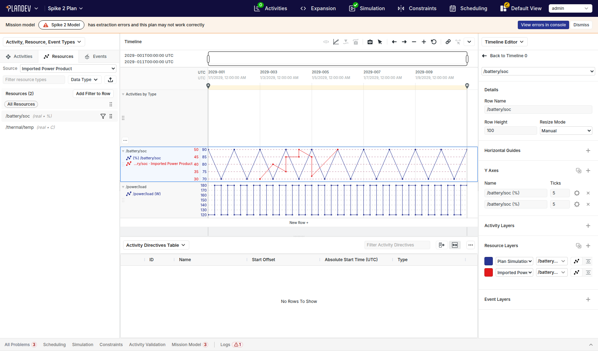

# Spike 2: multiple independent timeline sources in one PlanDev timeline: findings

**Question.** Is source-qualified multi-source composition a small extension of the timeline architecture, or does PlanDev fundamentally assume one timeline data namespace?

**Answer.** It is a small extension. The renderer is already namespace-agnostic. The single-namespace assumption lives in a handful of *lookup* sites that match resources by bare name. They are cheap to change, but the compiler does not find them for you.

On an ordinary Plan page, one row now shows two layers at once:

- `/battery/soc` from the plan's selected simulation, at 70–90 %;
- `/battery/soc` from an independent standalone dataset ("Imported Power Product"), at 30–50 %, covering only 2029-003 → 2029-006.

Each layer is bound explicitly to its own source. They can be edited independently, deleted independently, and saved to a normal `ui.view` and restored on reload. Legacy views load unchanged. Neither source's domain meaning changed: no `plan_dataset`, no schema change, no new tables.



| | |
|---|---|
| UI branch | `AaronPlave/plandev-ui` @ `claude/hopeful-cannon-cki37d`, commit `1f4d0b0` (Spike 2) on top of `d052465` (Spike 1) |
| Backend branch | `AaronPlave/plandev` @ `claude/hopeful-cannon-cki37d`: this doc, the fixture, and screenshots, on top of `cc4927b6` (Spike 1). **No backend code changes in Spike 2.** |
| Size of UI change | 24 files, +678 / −103. About 135 of the added lines are tests and about 125 are new helper/registry modules. The remaining ~420 are edits to existing files. |

---

## 1. What was implemented

### Source identity

```ts
// types/timeline.ts
export type ResourceLayerFilter = string | ResourceRef;      // was: string
export type ResourceRef = { name: string; sourceId: string };

// types/timelineSource.ts
interface TimelineResourceProvider {
  readonly key: string;          // data revision: invalidation (unchanged from Spike 1)
  readonly sourceId: string;     // NEW: binding identity, what layers reference
  subscribeResource(name, range?): TimelineResourceSubscription;
}
type TimelineSource = { id; label; provider: Provider | null; resourceTypes: ResourceType[]; resourceTypesLoading? };
type TimelineSourceRegistry = { defaultSourceId: string | null; sources: TimelineSource[] };
```

- `Resource` and `ResourceType` gain an optional `sourceId`.
- **The one rule used everywhere:** an absent `sourceId` means "the timeline's default source". This applies both to a legacy string filter and to an unstamped `Resource`/`ResourceType`.
- Helpers in `utilities/timelineSources.ts`:
  - `resolveResourceRef`
  - `toResourceLayerFilter` (the canonical stored form)
  - `getResourceRequestKey` → `` `${sourceId}::${name}` ``
  - `resourceMatchesFilter`
  - `getSourceLabel`

**Source ids used:**

| Source | `sourceId` | `key` (provider revision) | Time origin |
|---|---|---|---|
| Plan's selected simulation | `plan-simulation` (a *role*, not a dataset id) | `plan-simulation:<dataset_id>` | `simulation_start_time ?? plan.start_time` (Spike 1 provider, unchanged) |
| Standalone dataset | `standalone:<standalone_dataset.id>` | `standalone:<dataset_id>` | `standalone_dataset.start_time` |

**`sourceId` ≠ `key` is a real finding, not a naming nicety.**

- If plan-sim layers bound to `plan-sim:<simulation_dataset id>` (as in the spec's example), every re-simulation would orphan every saved layer.
- With a role id, re-simulation changes only the provider `key`. Rows re-request, and the view is untouched.
- This was verified: after inserting a new simulation dataset and reloading, the same saved view read dataset 13 instead of 11. The attached source was unchanged.

### Row: provider registry

- `Row.svelte` takes `timelineSources: TimelineSourceRegistry` instead of `resourceProvider`.
- For each resource layer, it resolves `(sourceId, name)`, looks up `providers[sourceId]`, and keys `resourceRequestMap` by `sourceId::name`.
- Each lifecycle path is per-entry:
  - dedupe;
  - unsubscribe when no layer references the entry;
  - invalidate when *that source's* provider key changes;
  - a provider that is not ready (`null`) issues no request;
  - a source missing from the registry gives an explicit error entry: `Source "standalone:9" is not available for /battery/soc`.
- Loaded resources are stamped with `sourceId` so downstream matching can use it.
- Row still knows nothing about plans, simulations, or standalone datasets.

### Downstream lookups made source-aware

- `getResourceForLayer(layer, resources, defaultSourceId)` now matches `(source, name)`. The optional third argument is threaded through:
  - `getYAxisBounds` / `getYAxesWithScaleDomains`
  - `RowHeader`, `RowYAxes`, `TimelineTooltip`
- `createTimelineResourceLayer` keeps a catalog entry's `sourceId` on the new layer.
- `views.ts` `getUpdatedLayerWithFilters` used to overwrite the new layer's filter with `itemNames[0]`. That silently stripped the source. The overwrite is removed.

### Plan page: registry, editor, resource browser

- **`stores/timelineSources.ts`:** `createPlanTimelineSourceRegistry(user, attachedSources)`. Source A is the Spike 1 plan provider, with the same gating: no sim → `null`; keep the provider while model types load. The page adds each standalone dataset named in `?standaloneDataset=<id>[,<id>…]`.
  - Attached sources appear immediately as "loading" placeholders, so layers never flash "unavailable".
  - The registry goes into the Spike 1 catalog context as a new `sources` field.
- **`TimelinePanel`:** reads the registry from context. Its fallback is a plan-only registry.
- **`TimelineLayerEditor`:** two controls, **Source ▼** and **Resource ▼**. The Source control only appears when there is more than one source. The resource list comes from the selected source's catalog.
  - Switching source keeps the name if the new source has it, otherwise clears it.
  - A layer bound to a source missing on this page shows as `standalone:9 (unavailable)` rather than being rebound.
- **`ResourceList`:** a **Source** select above the list. Items from a non-default source carry `sourceId`. Because the DnD payload is `JSON.stringify(items)`, source identity survives this path unchanged:

  ```
  TimelineItemList → DnD / "add to row" menu → onTimelineItemsDrop → viewAddFilterToRow → createTimelineResourceLayer
  ```
- **Labels:**
  - Row-header labels from a non-default source read `/battery/soc · Imported Power Product`.
  - The label tooltip shows `name (source)`.
  - The timeline tooltip gets a `Source:` line whenever the timeline has more than one source, so legacy single-source tooltips are unchanged.

### Persistence

- `ui.view.definition` is `jsonb`; the object form saves with no DB change.
- `ui-view-schema-v3.json`'s `filterResource.resource` is widened from `string` to `oneOf [string, {name, sourceId}]`.
  - Without this, *Download view → Upload view file* rejects the view.
  - The save path does not validate at all, which is why saving worked before the schema change.

### Resource status registry (Part E)

`stores/timelineResourceStatus.ts` keyed state by `` `${datasetId}:${name}` ``. The two writers use **different id spaces**:

- `createProfileSubscription` keys on `merlin.dataset.id`;
- `createExternalResourceSubscription` keys on `simulation_dataset.id`.

So simulation_dataset 12's external `/battery/soc` and dataset 12's profile `/battery/soc` would share a refcount and state entry. When one was released, the other's status indicator entry was deleted. This is pre-existing and independent of Spike 2, but multi-source makes it more likely.

**Fix:** the key is `` `${kind}:${id}:${name}` ``, and `kind` is passed to acquire/release. A regression test was added.

With that fixed, `(merlin.dataset.id, name)` is sufficient for profiles from any owner, standalone included, because `merlin.dataset.id` is globally unique. No provider-level source identity is needed in this store.

### Fixture

`deployment/spike/spike2_multisource_fixture.sql`:

- `Spike 2 Plan`: 2029-001, 10 days. A model declaring `/battery/soc` and `/power/load`. A successful `simulation_dataset` written directly with a 70–90 % sawtooth `/battery/soc`.
- `Imported Power Product`: a standalone dataset, 2029-003 → 2029-006, with `/battery/soc` at 30–50 %. It steps to 45 at offset 24h, which is 2029-01-04T00:00Z. It also has `/thermal/temp`.
- The standalone dataset is deliberately **not** attached through `plan_dataset`.

---

## 2. Verification

Everything below ran against the live local stack: Postgres + Hasura + gateway from source + `vite dev`, with scripted Playwright.

| Check | Result |
|---|---|
| **Existing plan behavior** (`/plans/2`, default view; baseline taken *before* any Spike 2 code) | Same rows/labels/ticks before and after: `/battery/soc (%)` 70–90, `/power/load (W)`; no errors ([baseline](docs/spike2/01-plan-baseline.png)) |
| **Multi-source basic** (`?standaloneDataset=9`) | Resource list shows `Plan Simulation` / `Imported Power Product`; each source lists its own `/battery/soc` |
| **Same-row overlay**: standalone `/battery/soc` added to the existing plan `/battery/soc` row | Two labels `/battery/soc (%)` and `/battery/soc · Imported Power Product (%)`; both lines drawn; ticks `70..90` + `30..50` (separate axes) |
| **Shared Y axis**: layer B moved onto layer A's axis | Domain spans both sources: ticks `30,40,…,90` ([screenshot](docs/spike2/03-shared-y-axis.png)) |
| **Different origins / partial coverage** | Red line starts at 2029-003 and ends at 2029-006. Hover at 2029-003T12:00 gives `Plan Simulation … 2029-003T12:00:00 … 70 (%)` and `Imported Power Product … 2029-003T12:00:00 … 40 (%)`. Offset 12h lands on 2029-003T12:00, not 2029-001T12:00 ([screenshot](docs/spike2/04-tooltip-both-sources.png)) |
| **Edit A without affecting B** | A → `/power/load`: B still `/battery/soc · Imported…`. B source → Plan Simulation (name kept) → back to Imported: correct each step. A → `/battery/soc`: back to overlay |
| **Delete A** | B still rendered, axis re-fits to 30–50, **0 profile requests** after the delete (so B's subscription was not torn down and redone). Counter confirmed working: 4 requests on load |
| **Save → reload** (`?standaloneDataset=9&viewId=1`) | Overlay restores exactly, including shared axis. Stored JSON: A = `"/battery/soc"`, B = `{"name":"/battery/soc","sourceId":"standalone:9"}` |
| **Saved overlay, source not attached** (`?viewId=1`) | Plan layers render; B shows the row error "Failed to load profiles for 1 layer" (detail: source not available) ([screenshot](docs/spike2/05-source-not-attached.png)) |
| **Legacy view** (a `ui.view` with only string resource refs), with and without the attachment | Renders exactly as the default view; strings resolve to Plan Simulation |
| **Re-simulation**: new `simulation_dataset` inserted, page reloaded with the same saved view | Plan layers read the new dataset (13); standalone layer unaffected; view unchanged |
| **View schema** | Saved overlay view fails the old v3 schema (`must be string`) and passes the widened one; `{name}` without `sourceId` is rejected |
| **Spike 1 standalone page** (`/datasets/8`) flow re-run | Add, rename, save and reload rows; spans; zoom: unchanged |
| svelte-check / eslint / prettier | 0 errors / clean / clean |
| vitest | **886 passed** (70 files), including new `timelineSources.test.ts` (7 tests: legacy resolution, canonical form, key non-collision, `(source,name)` matching independent of array order, shared-axis bounds, source-preserving layer creation) and `timelineResourceStatus.test.ts` (kind collision) |

**Not verified:**

- **Live** simulation-dataset switching within one page session. Only a reload was tested; I couldn't drive the simulation-history UI in time. The per-source invalidation path is the same code, and the load sequence shows it: the standalone provider arrives asynchronously after the plan provider, and plan layers were not refetched.
- Two-source *x-range* (discrete) overlay. Same code path as line; not exercised.
- The UI e2e suite, which needs merlin-server.

---

## 3. Answers to the spike questions

**1. Can one timeline consume multiple resource providers?**
Yes. A registry keyed by source id replaced the single provider with about 60 changed lines in `Row.svelte`. `Timeline.svelte` only forwards it.

**2. Is `(sourceId, resourceName)` sufficient identity?**
Yes, for resources, *provided* `sourceId` is the binding identity and a separate provider `key` carries the data revision.

- Nothing needed schema or type in the identity. The schema comes from the source's catalog.
- Two caveats for production:
  - **What `sourceId` should be (see Q11).**
  - **The plan source is itself a merged namespace.** `allResourceTypes` dedups model resources and `plan_dataset` resources by name. `createPlanTimelineResourceProvider` routes a name to "sim profile if the model declares it, else external plan_dataset". Spike 2 left that intact, because an external plan resource named like a model resource was already unreachable. A production design should probably make each `plan_dataset` its own source rather than a name-precedence merge.

**3. Where does bare-name identity leak?** Every site found:

| Site | Leak | Caught by `tsc`? |
|---|---|---|
| `types/timeline.ts` `ResourceLayerFilter = string` | the type | — |
| `Row.svelte` `resourceRequestMap[name]` | request dedupe/lifecycle keyed by name; single provider | no (string key) |
| `utilities/timeline.ts` `getResourceForLayer` → `getYAxisBounds`, `RowHeader`, `RowYAxes`, `TimelineTooltip` | `layer.filter.resource === resource.name` | no (string compare) |
| `TimelineTooltip` unit lookup | against the global `resourceTypes` (plan model) | no |
| `createTimelineResourceLayer` | writes `name` only | no |
| `views.ts` `getUpdatedLayerWithFilters` | re-assigns `filter.resource = itemNames[0]`, stripping the source | no |
| `TimelineLayerEditor` | options, selection and default layer name by name | **yes** (the only 4 errors `tsc` reported) |
| `ResourceList` / `allResourceTypes` | one flat, name-deduped list | no |
| `ui-view-schema-v3.json` | `resource: string` | no (runtime, upload path only) |
| `timelineResourceStatus` | `(id, name)` with mixed id spaces | no |

Not leaks:

- `LayerLine`, `LayerXRange` and `LayerGaps` only use `filter` as a reactive trigger and draw whatever `resources[]` they are handed.
- Sampling, decimation and the time scale.
- `Point.name` / `Resource.name` are display strings once lookup is fixed.

**4. How invasive is carrying source identity on a layer?**
Small. The main cost is that **a string→union type change is found by `grep`, not by the compiler**: 9 of the 10 sites above typecheck with the union.

- In production, make `ResourceRef` the only in-memory form. Normalize once at view load, so every consumer takes a `ResourceRef`. Then the compiler enforces it.
- Keep the string only as a serialized shorthand.

**5. Can legacy views stay compatible without a major migration?**
Yes: "bare string = default source". Nothing was rewritten.

- The editor writes the string form back for the default source (`toResourceLayerFilter`), so plan-only edits keep producing views older UIs can read.
- An older UI reading an object ref would drop that layer. It would compare an object to a name, and the Row key would become `"[object Object]"`. Mixed-version deployments need the schema-version gate (Q11).

**6. Can two resources with the exact same name render in one row?**
Yes, with no renderer changes:

- separate axes or a shared axis;
- independent hover;
- independent edit and delete.

**7. Do Y-axis and domain calculations work across sources?**
Yes, once `getYAxisBounds` looks resources up by `(source, name)`. A shared axis spans 30–90. `fitTimeWindow` and `fitPlan` modes are untouched.

**8. Does each provider keep its own absolute time origin with no timeline changes?**
Yes, with zero timeline changes. Each provider converts offsets to absolute ms from its own origin. Partial coverage renders only inside the covered range.

- **One UX wart (pre-existing semantics):** "Nearest value" hover snaps to the nearest point even outside a source's coverage. Hovering 2029-002 reports the imported source's 2029-003T00:00 value.
- With partial-coverage sources this reads as data where there is none. The tooltip should say "no data" outside a resource's extent.

**9. Does the catalog-context approach scale to multiple sources?**
Yes. Context works because the route component is the common ancestor of the timeline, editor and item-list panels. Two consequences:

- the context now carries **live data-access objects (providers)**, not just type catalogs;
- the Spike 1 `resourceTypes` field is superseded by `sources`.

In production the registry should *be* the context, with one object: `{ sources: { id, label, provider, catalog } }`. The plan-page stores should be one implementation of a source, not a fallback.

**10. What minimum source metadata does the editor need?**

- `id`
- `label`
- the source's resource catalog (`name` + `ValueSchema`)
- readiness (not ready / loading)
- availability: is the source present on this page at all?

Nothing about time range, provenance, owner or kind was needed.

**11. Can `ui.view` store multi-source bindings without DB changes?**
Yes; it's `jsonb`. Two real issues:

- The JSON schema is only enforced on *upload*. Production needs a schema bump (v4 plus a no-op or normalizing migration), not the in-place v3 widening done here.
- **`ui.view` is not bound to a plan.** Persisting `standalone:9` makes a view carry a concrete dataset reference. Opened on another plan, it shows an "unavailable" layer. The role id `plan-simulation` is portable; instance ids are not.
  - The durable shape is probably **view-local source slots**. The view declares `sources: [{ slot: "imported", kind: "standalone-dataset" }]`, layers reference the slot, and the binding `slot → concrete dataset` lives with the plan or analysis that opens the view. That binding is exactly the "source association" Spike 2 faked with a query parameter.

**12. What is the next structural blocker after resources?**
Spans/intervals, and they are harder:

- `Timeline`/`Row` take one `spans` / `spansMap` / `spanUtilityMaps` / `selectedSpanId`.
- `span_id` is only unique within a dataset, so two sources' spans collide in `spansMap`, selection, and hierarchy maps.
- Activity-layer filters bind to **type names** (`static_types`, `dynamic_type_filters`), the same bare-name namespace problem one level up.
- The type catalog (`planModelActivityTypes` / Spike 1's `intervalTypes`) is singular.

After that come:

- view→source binding semantics (Q11);
- a per-`plan_dataset` source split (Q2);
- timeline bounds for plan-independent views: today `maxTimeRange` is the plan's (see §5).

**13. Does the architecture still support "domain objects → common timeline-source/query layer → multi-source Analysis View"?**
Yes; Spike 2 is direct evidence.

- Two sources with different owners, id spaces and time origins compose through a ~40-line registry and a `(sourceId, name)` ref.
- The core renderer is untouched, and neither domain object changed meaning.
- The seam is `TimelineSource { id, label, provider, catalog }`. Providers own resolution and time; the timeline owns only absolute time and drawing.

**14. What to keep and what to discard:**

- **Keep:**
  - the provider interface with *both* `sourceId` (binding) and `key` (revision);
  - `ResourceRef` plus the "absent = default" normalization;
  - `sourceId::name` request keys;
  - source-aware `getResourceForLayer`;
  - the registry-in-context pattern;
  - role-based id for the plan simulation;
  - two-control Source/Resource editor semantics;
  - the Spike 1 standalone table and provider;
  - the status-registry key fix;
  - the `views.ts` overwrite fix;
  - the tests.
- **Discard or replace:**
  - `?standaloneDataset=` attachment → a real, persisted binding (slots);
  - in-place v3 schema widening → v4;
  - `resolveResourceRef` sprinkled at consumers → normalize at view load;
  - `defaultSourceId` threaded as an optional parameter → part of the registry passed everywhere;
  - plain `<select>` controls;
  - "Standalone dataset N (loading)" placeholder labels;
  - stamping each loaded `Resource` with a shallow copy (fine, but a typed `SourcedResource` is cleaner).

---

## 4. Dependency classification (Spike 1 table extended)

Assumptions: **Plan** (needs a plan), **Sim** (needs a simulation dataset), **1-source** (one data source per timeline), **Bare-name** (resources identified by name alone). ✅ = assumption removed; ⚠️ = still present; — = never had it.

| Component | Plan | Sim | 1-source | Bare-name | Notes |
|---|---|---|---|---|---|
| `Row.svelte` (resources) | ✅ (S1) | ✅ provider-owned | ✅ registry | ✅ `sourceId::name` | activity/span half still single-namespace |
| `Timeline.svelte` | ⚠️ props named `plan*`, still passes spans | ⚠️ spans props | ✅ resources / ⚠️ spans | ✅ | forwards the registry |
| `TimelinePanel.svelte` (plan) | ⚠️ intrinsic (it is the plan panel) | ⚠️ intrinsic | ✅ reads registry | ✅ | |
| `RowHeader` / `RowYAxes` | — | — | ✅ | ✅ | |
| `TimelineTooltip` | — | ✅ unit lookup from registry | ✅ | ✅ | nearest-value ignores coverage |
| `LayerLine` / `LayerXRange` / `LayerGaps` | — | — | — | — | never assumed any of it |
| `utilities/timeline.ts` resource helpers | — | — | ✅ | ✅ | optional `defaultSourceId` arg |
| `TimelineLayerEditor` | ✅ (catalog) | ✅ | ✅ Source control | ✅ | |
| `ResourceList` | ⚠️ upload UI is plan_dataset | ⚠️ upload "use selected simulation" | ✅ source picker | ✅ | |
| `views.ts` add-filter path | — | — | ✅ | ✅ (overwrite removed) | activity/event paths unchanged |
| `createPlanTimelineResourceProvider` | intrinsic | intrinsic | n/a | ⚠️ merges model + plan_dataset names | see Q2 |
| `timelineResourceStatus` | — | ⚠️ `kind: 'sim'` label also used for standalone | — | ✅ `kind:id:name` | |
| `ui.view` / schema | ⚠️ `definition.plan.*` naming | — | ✅ | ✅ (object form accepted) | instance ids in portable views (Q11) |
| spans / activity layers (`spansMap`, `selectedSpanId`, `static_types`) | ✅ (S1) | ⚠️ | ⚠️ **untouched** | ⚠️ type names, `span_id` per dataset | the next blocker (Q12) |

---

## 5. Explicit decisions and temporary workarounds

- **View bounds = Plan bounds** (Part K). The standalone source may extend past them and is simply clipped. Union, intersection, manual and primary-source policies are deferred.
- **Source selection is a query parameter**, `?standaloneDataset=9[,…]`. It is not persisted; the saved view persists only the layer's `sourceId`.
- **Canonical stored form:** default source → string; any other source → `{name, sourceId}`.
- **Catalog stamping:** the default source's catalog is unstamped; other sources' entries carry `sourceId`. That is how drag/drop and "add to row" produce qualified layers without the view store knowing about the registry.
- **Resources only.** Spans, directives, external events, `selectedSpanId`, `spansMap`, `spanUtilityMaps` and activity filtering are unmodified. The Plan page uses its own spans as before. No resource work needed to touch them.
- **No backend changes.** No `analysis_view`, `view_source` or `source_binding` tables.

## 6. Lifecycle caveat (from Spike 1, still open)

`merlin.standalone_dataset` deletes its `merlin.dataset` on delete, and so does `plan_dataset`. If the same dataset were ever referenced by both, two wrappers would each believe they own deletion.

Spike 2 avoids this entirely: Source B is referenced directly by `standalone_dataset.id` and never through `plan_dataset`. A production "attach an independent source to a plan" must be a non-owning reference, e.g. a slot binding (Q11), never a second owner.

## 7. Bugs

From Spike 1, still only fixed on the spike branches and not extracted:

1. Spans with no directives do not render (`Row.svelte` `hasActivityLayer`). Fixed on the UI spike branch.
2. Real profile gaps with null dynamics crash `sampleProfiles`. Fixed on the UI spike branch, with a test.
3. `merlin.delete_partitions()` uses unqualified partition names and depends on `search_path`. **Not fixed.**

New in Spike 2:

4. **`timelineResourceStatus` key collision** between `merlin.dataset.id` (profiles) and `simulation_dataset.id` (external). Pre-existing, independent of multi-source. Fixed, with a test. Worth extracting.
5. **`getUpdatedLayerWithFilters` re-assigned the resource filter** after `createTimelineResourceLayer` had set it. It was harmless before; it strips source identity with source refs. Removed.
6. **The view JSON schema is only enforced on upload**, not on save. A saved view can therefore be un-uploadable. It is pre-existing; Spike 2 exposed it.
7. **Hover "nearest value" crosses coverage boundaries** (Q8). A UX issue, not a crash.

## 8. Recommended production shape

```
TimelineSource        { id, label, kind, catalog: ResourceType[], provider }   // one per bound source
TimelineSourceRegistry{ defaultSourceId, sources }                             // one context object
ResourceRef           { sourceId, name }  (only in-memory form; string = serialized shorthand)
View (v4)             sources: [{ slot, kind }]  ; layer.filter.resource: { slot, name } | "name"
Binding (per plan / analysis, server side)   slot -> concrete source (sim role, standalone dataset, plan_dataset…)
```

- **Migration:** a v4 up-migration that leaves string refs as they are (they mean the default slot) and validates object refs. No rewrite of existing views is required.
- **Split `plan_dataset`s into their own sources** instead of the name-precedence merge.

## 9. Recommendation for Spike 3 / next work

1. **Multi-source spans/intervals.** Make the span props source-scoped: `spansBySource`, with `(sourceId, span_id)` identity for selection and hierarchy. Activity-layer filters become `(sourceId, type)`. This is the same pattern applied one level up. Expect it to be harder than resources, because the span path has more global stores (`selectedSpanId`, `spansMap`, `spanUtilityMaps`, directive linkage).
2. **Source binding persistence** (view slots + a per-plan/analysis binding) to replace the query parameter. Decide it together with the `plan_dataset` ownership question (§6).
3. **A plan-independent multi-source page:** the Spike 1 standalone page plus a registry of N standalone sources. Decide bounds policy (union vs manual) there.
4. **Extract bugs 1, 2, 3 and 4** as independent upstream fixes; they don't depend on either spike.

## Appendix: how to run

```bash
# DB (after the Spike 1 schema/fixtures are present)
psql "$PLANDEV_DB" -f deployment/spike/spike2_multisource_fixture.sql   # prints plan_id, standalone_dataset.id
# UI
http://localhost:3000/plans/<plan_id>?standaloneDataset=<standalone_dataset.id>
#   Resources tab -> Source: Imported Power Product -> /battery/soc -> add to the /battery/soc row
#   Timeline Editor -> Resource Layers: Source ▼ + Resource ▼ per layer
```
